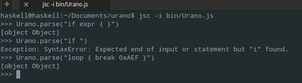

# Urano Lang

> A Rust-based programming language with gradual and duck typing that targets PHP.


Urano is a programming language that targets PHP, based in Rust syntax and TypeScript type system, with support
to gradual and duck typing, with the following features:

- Type safe, with primitive types and extensible type system;
- Support for protocols and type derivations;
- First-class type system;
- Multi-paradigm (functional, imperactive, object oriented);
- Operator overloading;
- Code optimization.

#### Hello World

```swift
func Main: void {
  let hello: string = "Hello World!"
  in print(hello)
}
```

```php
function Main() {
  echo "Hello World!";
}
```

#### Factorial

```swift
protocol for func Fact: number in (n: number)

func Fact: number in (n: number) {
  match n with {
    0 = 1,
    _ = n * Fact(n - 1)
  }
}
```

```php
<?php

function Fact(n) {
  return n === 0
    ? 1
    : n * Fact(n - 1);
}
```

#### While-else control structure

```swift
do while (let pokemon: number = [int]readline("Pick a pokémon!", PHP_EOL)) <= 4 {
  match pokemon {
    1 = "You chose charmander!"
    2 = "You chose squirtle!"
    3 = "You chose bulbasaur!"
    _ = "You chose pikachu!"
  } |> print
} else {
  print("Invalid pokémon!")
}
```

### Test parser




### What is already implemented on parser?

- Return statement
- If/Elsif/Else statement
- Import statement
- While/Else statement
- Loop statement
- Break statement
- Integer as expression (decimal, hexadecimal, octal)
- Identifiers
