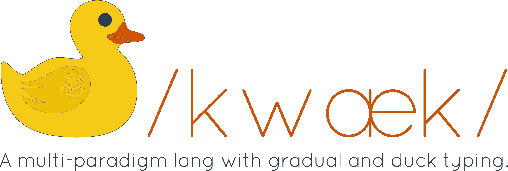

<p align="center">
  <a href="">
    
  </a>
</p>

<p align="center">

  <a href="https://quack-lang.herokuapp.com/"></a>

  <a href="https://travis-ci.org/quack/quack"></a>

  <a href="https://codeclimate.com/github/quack/quack"></a>

  <a href="https://codeclimate.com/github/quack/quack/coverage"></a>

  <a href="https://codeclimate.com/github/quack/quack"></a>

  <a href="#"></a>
</p>

### What is Quack?

Quack is a type-safe, multi-paradigm programming language. Quack enables you to write consistent and legible code, and run it on different platforms.

### Quack is:

#### Type safe

You can optionally provide type annotations for your values, although it isn't really necessary because we rely on duck and gradual typing. The Quack compiler is being built to be decidable by propagation and with a strong type inference.

#### Multi-paradigm

Quack supports many programming paradigms, especially functional and imperative programming. Quack also supports tacit programming,  immutability and determinism when possible.

#### Metaprogrammable and extensible

The language is metaprogrammable and very extensible. You can easily build extensions for the language and provide than as libraries with annotations. You can create operators at compile time, override current operators, match operations by type, implement inline optimizations via the own compiler and easily build DSLs over it.

### Basic examples

#### Hello World

```ruby
fn main
  print "Hello World!"
end
```

#### Factorial

```ruby
-: imperative
fn fact [n]
  let fact :- 1
  for i from 1 to n do fact :- fact * i
  ^ fact
end

-: tail_call_recursion
fn fact [n]
  ^ n = 0 then 1 else n * fact[ n - 1 ]
end
```

### How does it work?

First of all, Quack compiler is, currently, entirely written in PHP, by hand. I'm doing this because I want to easily make it self-hosted and write the compiler in itself later. The front-end of the compiler is easy to extend and you can provide multiple back-ends for it. I'm writing standard libraries in the language for itself to allow interpreting it and running the compiler on desktop, on browser and interpreting it using the evaluator of any target language. Basically, when integrating Quack with your main programming language, you need to provide a set of type annotations for your libraries and for the language core. For JavaScript, I'm writing a tool that is able to convert TypeScript type definitions `.d.ts` for Quack type definitons `.qkt`, making the life easier. The initial support will be provided for **PHP**, **Python** and **JavaScript**. Please note that Quack is in its early stage, and in constant development. Quack also provides a [REPL that you can try online here](http://108.167.188.125/~conta180/quack/), currently generating the AST of the source.

### Get Quack

#### REPL

To get and try Quack, the steps are simple. Clone this repository and install the `src` folder under `/quack/quack`. I promise I'll provide a better way to do it later. After, `cd /quack/quack/src/repl` and `php QuackRepl.php --ast` (you can also try with `--python`, but it is unstable yet). You will be sent to the REPL. Currently, the REPL is only compatible with POSIX systems. I'll implement support for Windows later, I promise too!

#### Run tests

Assert that everything is **OK**. There is a small set of tests that may be run.

`make test module=module_name`

**Modules**

| `lexer` | `parser` |
|---------|----------|

### Syntax Support

#### Vim

Quack syntax support to Vim's built-in editor [quack/editor/vim/quack.vim](https://github.com/quack/quack/tree/master/editor/vim)

### Contribute to Quack!

Yay! Your contribution for the Quack language core is **very** important! There is **a lot of work** to be done, and you can find them in this repository's issues! Look for the `accepting-pull-requests` label! Newcomers to the open-source contribution process are very welcome! Please, read the `CONTRIBUTING` file in this repository as well!

There are many ways to help! You can fix typos, improve code quality, suggest changes, suggest language features, be engaged on the language discussion, standardize the code, doc-comment the methods, write and run tests... The work is just starting out!

We also need to implement support of Quack for the different text editors. If you want to implement for some, contact me and I'll write the syntactic specification and the semantic of the blocks for you!

Questions or concerns? Contact me at <marcelocamargo@linuxmail.org> and I'll be happy to answer.
